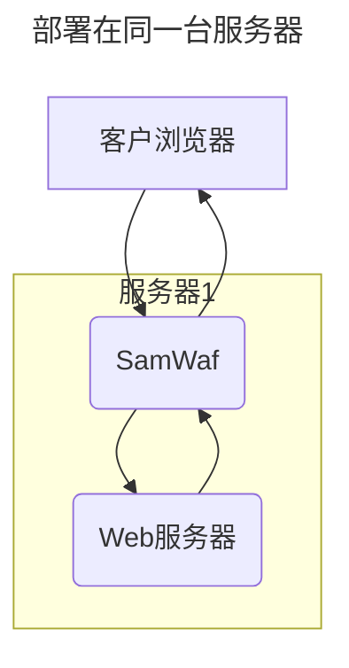
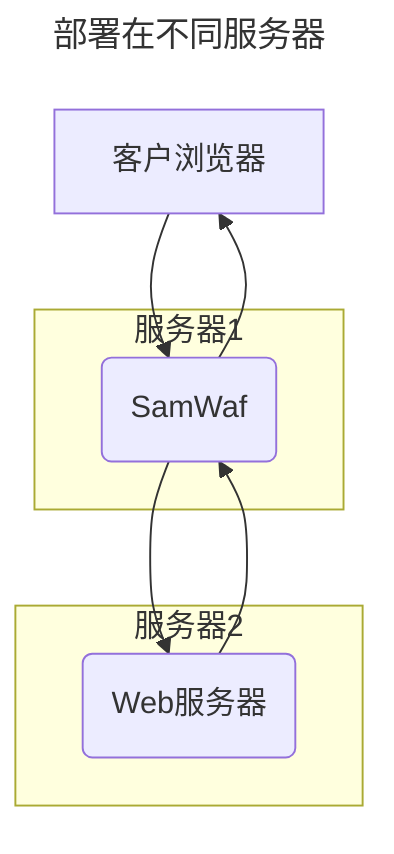

# 网站配置
  
## 1 部署架构：
请依据下面的架构方式布局SamWaf防火墙

### 1.1 部署在同台服务器（常见）
::: important
重要:部署在同台服务器会存在端口：80、443已经占用得情况 ，请在本机或者网站业务不繁忙得时候操作。[修改查看常见问题](./Question.md#_1-端口80-被占用情况)  

:::

### 1.2 部署在不同服务器
此部署方式适合服务器资源丰富将SamWaf单独部署，域名解析到SamWaf所在服务器即可。
后面接入各各网站服务器，只暴露SamWaf所在服务器

